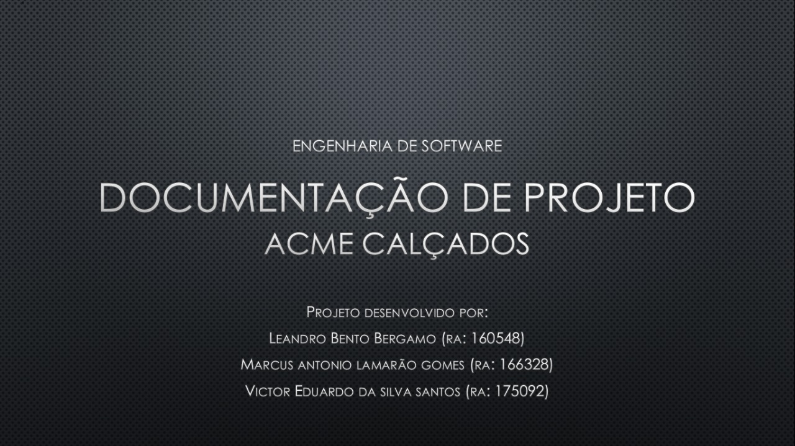
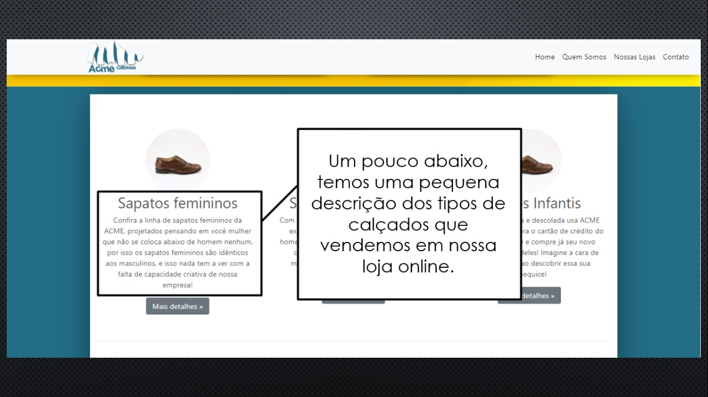
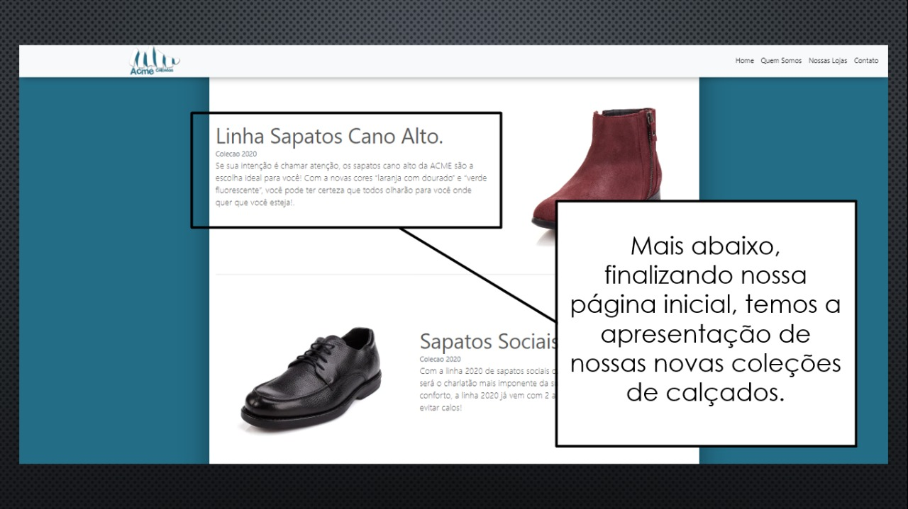

# TP - Engenharia de Software
> Criação de um site institucional.
Projeto realizado para a materia Engeharia de Softaware (2 bimestre) com o objetivo de gestão do projeto e implementacao das tecnologias HTML,CSS,Bootstrap, Javascript e Adobe XD. O objetivo foi facilitar a divulgação da empresa em um site responsivo e de facil acesso.

## Historico
* 0.0.3
    * Implantacao do README e informativos do Site
* 0.0.2
    * Alteração dos `lang` das paginas 
* 0.0.1
    * Implantação e hospedagem no sistema Github
* 0.0.0
    * Iniciação do Projeto

## Construido com

* [BootStrap](https://getbootstrap.com.br/docs/4.1/getting-started/introduction/) - BootStrap - Versão 4.1.3

## Autores

* **Leandro Bento Bergamo** - *Trabalho de Faculdade* - [Git-Hub](https://github.com/lbbergamo/)
* **Victor Eduardo da Silva Santos** - *Trabalho de Faculdade*  [E-mail](victor.eduardo100@live.com)
* **Marcus Antonio Lamarão Gomes** - *Trabalho de Faculdade*  [E-mail](marcus.antonio2201@gmail.com)

## Agradecimentos

* Professor Claudio Nunes
* Aperfeiçoamento/Aprendizado do HTML e CSS
* Aperfeiçoamento/Aprendizado do Framework BootStrap
* Aperfeiçoamento/Aprendizado do GitHub
* Aperfeiçoamento/Aprendizado do @Media
* Utilização de Codigos Externos
* etc